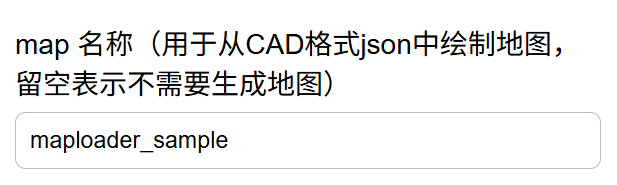

问题
1.mulh/mul是一个周期内完成吗？为什么波形图显示是一个周期完成？
2.波形图能不能添加光标，像vivado那样把所在位置变量值显示出来在下方？因为如果一个窗口里面步数太多，数值显示不全，不方便观察
3.选择二进制程序运行框不要显示文件名前面带“.”的比如.gitignore

4.建议把“绘图仪调用”功能重新做一个页面，里面只运行一类程序：从json文件绘制地图程序。修改tests/map_device_caller_test.c以达到此要求。json文件放入plot/文件夹下，而且在地图列表也要显示下拉框：有哪些json文件是可用于地图的。ppm类型处理的部分就不要保留了。在这个页面需要给用户展示画好的图片。在此页标题下方加提示信息：（1）此页面用于运行绘图仪功能；（2）如果想修改地图json,请转移至添加文件页面（在下一个部分会说）
5.terminal页面是专门ssh连接用于发送所有命令，要改为只能输入读写文件命令（用于在前端“远程”添加测试文件），因为编译和运行命令已经打包到index_0501.html中。
6.同时，旧版terminal页面也要走新版server_0428.py的ssh连接

后续需要改的：
1.所有其他页面都直接链接index1.html页面,不要子页面相互直接跳转
2.按照index1.html前端风格重新设计index_0501.html风格(参考css,js文件夹)，如果发现所需样式没有，就用bootstrap的，也可以将bootstrap的svg文件引入页面
3.custom-inst页面不要动
4.如果存在未设计的子页面，就按照上述风格和逻辑继续补充。注意全局风格需要：简洁大方，白色为底色，不要出现大块深色区域；适当加入少量彩色
